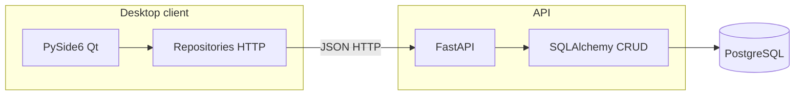

# Архитектура VKR_MAIN

## Обзор

- **Клиент** (`frontend/`, `start_app.py`): окно на PySide6, таблицы, диалоги, фоновая загрузка выборок в подклассах **`QThread`** (`QueryFetchThread`, `DashboardFetchThread` — без `moveToThread`+`QObject`, чтобы избежать гонок при `deleteLater`), кэш выборок, прокси-модель для поиска и сортировки.
- **Репозитории** (`backend/repositories/`): тонкая обёртка над `requests`; общие таймауты и логирование ошибок HTTP — в `backend/http_client.py`.
- **API** (`api/`): FastAPI, схемы Pydantic, операции CRUD в `crud.py`, модели SQLAlchemy в `models.py`.
- **БД**: PostgreSQL; строка подключения задаётся через переменные окружения / `.env` (см. `api/config.py`).

## Поток «выборка»

1. Пользователь открывает пункт меню «Выборка» → `MainWindow.show_query_table`.
2. При необходимости запускается **`QueryFetchThread`** с функцией `fetch` из репозитория.
3. По завершении в главном потоке вызывается `_render_query_rows`: `GenericTableModel` + `GlobalFilterProxyModel` + `QTableView`.

## Файлы ТЗ сценариев

- **API:** `api/scenario_files.py` (корень каталога, безопасное разрешение путей), эндпоинты в `api/api.py`, поля сценария в `models`/`schemas`/`crud`.
- **Диск:** каталог задаётся `SCENARIO_TZ_UPLOAD_ROOT` (см. `api/config.py`); подкаталоги `s{scenario_id}/`.
- **Клиент:** `frontend/views/scenario_tz_dialog.py`, репозиторий `backend/repositories/scenario_repo.py`.

## Поток «редактирование»

1. Активная выборка задаёт `_active_query_entity_label`.
2. Кнопка «Редактировать» читает выделенную строку и вызывает `_edit_*` для соответствующей сущности.
3. Диалог `GenericAddDialog` с `initial_data` → `PUT` на API → обновление кэша выборки и перерисовка таблицы.
